# Active Directory Lab

## Project description

In short, we can think of **Active Directory** as *Database* that contains users, computers, groups and more.
In order to use Active Directory, a server must install a service called **Active Directory Domain Services** (ADDS), and the server must then be promoted to a **Domain controller** (DC), by doing this, it will allows to perform **Authentication** using a protocol called **Kerberos** and **Authorization**.

I will be using:

- Target machine (Windows 10)
- Attacker machine (Kali Linux)
- Active Directory (Windows Server 2022)
- Splunk (Ununtu Server)
- Virtual Box

## Downloadand install VirtualBox

Go to the [Virtual box download page](https://www.virtualbox.org/wiki/Downloads) and click on **Windows hosts**.

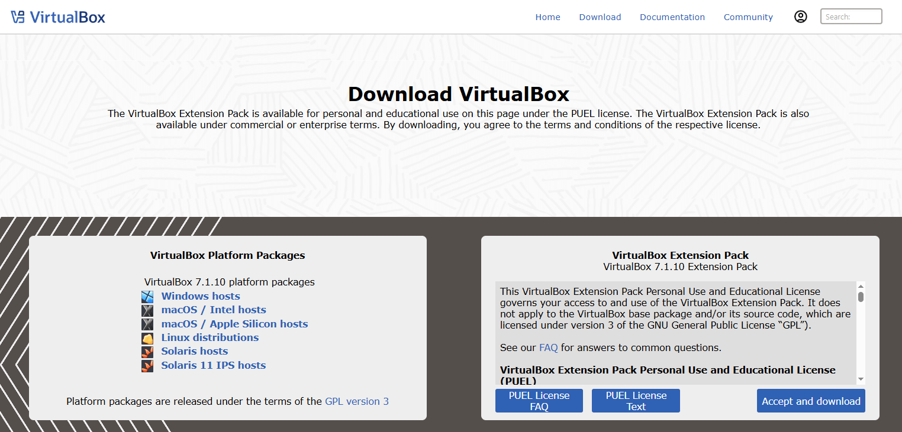

While it’s downloading, go ahead and check the `SHA256 checksums` to verify that the downloaded file has not been altered. To do this, go to your `Downloads` folder (or wherever you saved the installer), open a PowerShell console, and type:

```powershell
    Get-FileHash .\VirtualBox-7.1.10-169112-Win.exe  
```

This will return a SHA256 hash. Copy the hash, go back to the `SHA256 checksums` page on the VirtualBox website, and check if the hash matches one of the listed values (use Ctrl + F and paste the hash to search).

If the hash matches, you can be confident that the file was not altered during download. Now you can proceed with the installation of VirtualBox—just follow the instructions in the setup wizard and you should be good to go.

## Install Windows 10

Go to [this link](https://www.microsoft.com/en-ca/software-download/windows10), scroll down to the **Create Windows 10 installation media** section and click **Download now**. This will download the Media Creation Tool, which will help us create the Windows 10 image file.

Once you run the tool, on the **What do you want to do?** screen, select **Create installation media**, then choose **ISO file**.

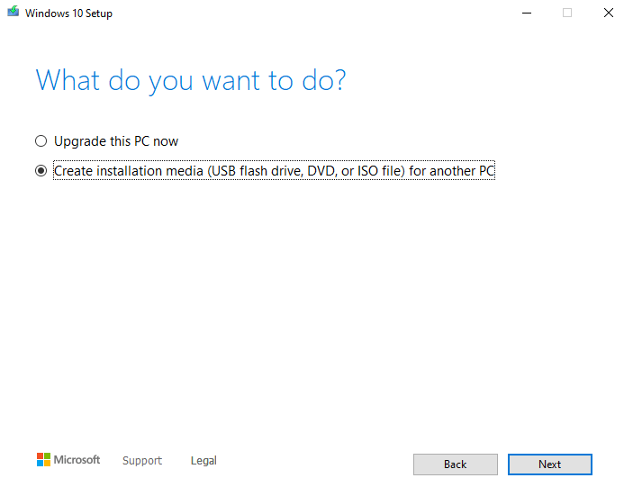

After downloading the Windows 10 ISO file, open VirtualBox and create your first virtual machine.

Click on **New**, and the **Create Virtual Machine** wizard. wizard will appear. Name the machine `windows10`, select the ISO image, and check the box **Skip unattended installation** — this allows us to install the operating system manually. 

Click **Next** to view the virtual machine specifications.

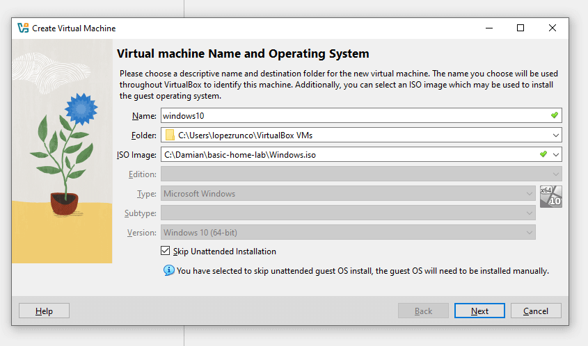

Note that these settings will depend on your computer's specifications. In this example, I’ll assign **2048 MB** of base memory and **1 CPU** under the processor settings.

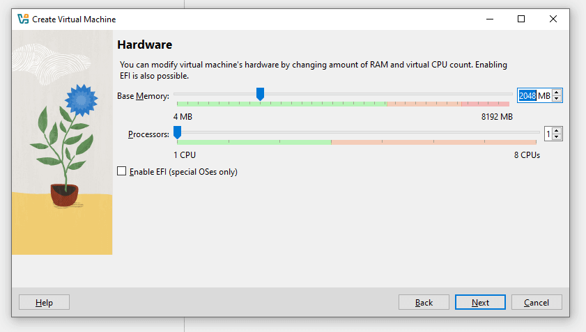

For the virtual hard disk, I’ll leave it at **50 GB** and click **Next**.

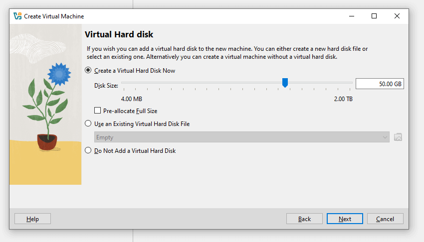

Next, the wizard will show you a summary of your virtual machine settings. If everything looks good, click **Finish**.

To power on your Windows 10 machine, simply click **Start**. You should now see the Windows 10 setup screen.

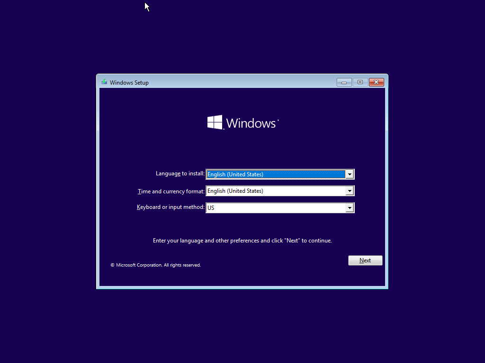

Click on **Install**, and when you reach the **Activate Windows** screen, click **I don't have a product key**. Then, from the list of options, select **Windows 10 Pro** and click **Next**. Accept the license terms.

On the next screen, choose **Custom: Install Windows only (advanced)**, select the drive, and click **Next**. Windows 10 should now begin installing in the background.

## Install Kali Linux

First, navigate to the [Kali website](https://www.kali.org), click on **Download**, and then select the **Pre-built VMs** menu item. I’ll be downloading the 64-bit version of Kali, but you should choose the option that matches your system architecture.

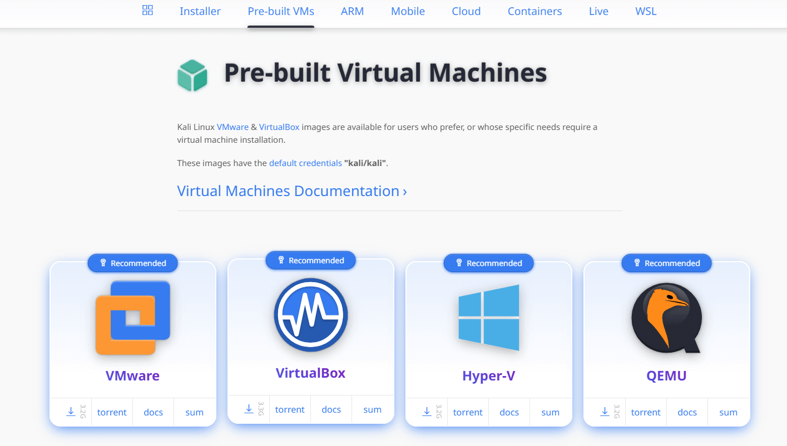

A `.7z` file will be downloaded, so you’ll need **7-Zip** to extract its contents. Once decompressed, look for the file with the `.vbox` extension and double-click it. Kali Linux should be automatically imported into VirtualBox.

Now you can start the Kali virtual machine.  
**Note:** The default credentials for the Kali Linux machine are `kali/kali`.

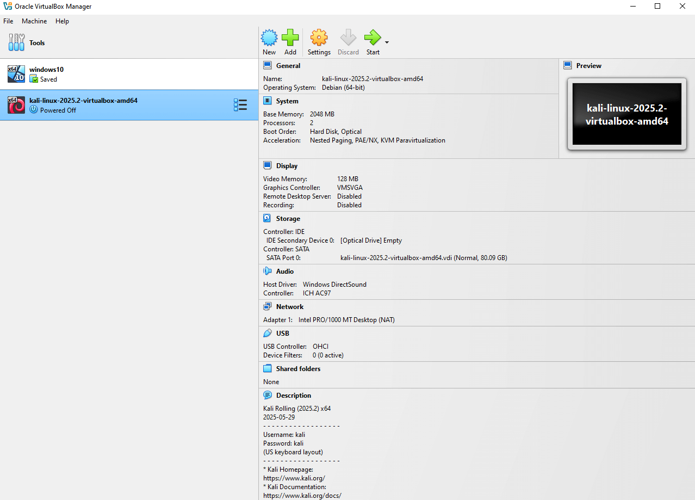

## Install Windows Server 2022

I downloaded Windows Server from [Microsoft Evalatuion Center](https://www.microsoft.com/en-us/evalcenter/evaluate-windows-server-2022) website, selecting the ISO file.

Once in Virtual Box, I named the machine `ADDC01`, added the ISO image, left all the settings as default but check in **Skip Unattended Installation** because I do not want Virtual Box to automatically install it. In the **Hardware** tab I setted the **Base Memory** to 4GB, and that's all the configuration so far.

Once in the virtual machine I choose the **Windows Server 2022 Standard Evaluation (Desktop Experience)** version of the OS. 

In the **Type of installation** screen I selected **Custom** and click **Next** until the installation started.

After the set up was completed, I was presented with the **Customize settings** screen, where I created a password and then a **Login** screen to Enter the credentials I just created. Once in the Desktop, the **Server Manager** will open automatically. 

## Install Splunk Server

I downloaded the [Ubuntu Server](https://ubuntu.com/server) **22.04.5 LTS version**. Once in VirtualBox, I created a new machine named **Splunk** with the default configuration but checking **Skip Unattended Installation**, I set the **Base memory** in 4GB, the **Processors** in 2 and the **Virtual Hard disk** in 50GB.

Run the virtual machine and in the presented screen select **Try or Install Ubuntu Server**, continuing with the default options unitl the **Profile setup** screen, there I entered the credentials, hit **Done**. I left the next configurations by default and started the installation.
After it finished, I rebooted the virtual machine. If you are presented with the **Failed unmounting /cdrom** error, just press Enter.


After Ubuntu Server finished the reboot, I was presented with a login screen where I entered the credentials I created earlier. After a successfull login, I run the command `sudo apt-get update && sudo apt-get upgrade -y` to update and upgrade all the repositories and after that the server is ready to go.

At this point, I have the four virtual machines ready:

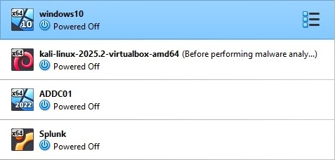

## Create a network

Back in Virtual box I checked that the network setting were set to NAT, that way, the virtual machines can be on the same network and still have internet access. Clicking in **Tools** and then **Network**, then selected **NAT networks** and click on **Create**.
I named this network **AD-Network**, set the IPv4 Prefix to `192.168.10.0/24` and checked the **Enable DHCP** option. Then I changed the network settings on every machine, selecting the **NAT Network** attached and selecting the network I created.

## Configure Splunk Server IP

I asigned a static IP to the Splunk Server by running the command `sudo nano /etc/netplan/00-installer-config.yaml`. In this file I indicated that I do not want any DHCP, assigned the address `192.168.10.10/24`, the Google's DNS IP `8.8.8.8` and a default route via `192.168.10.1`, at the end, the fily should look like this:

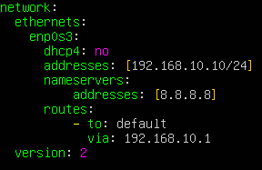

Saved the file and run `sudo netplan apply` and to verify the changes `ip a`, the ip address should be `192.168.10.10/24`:

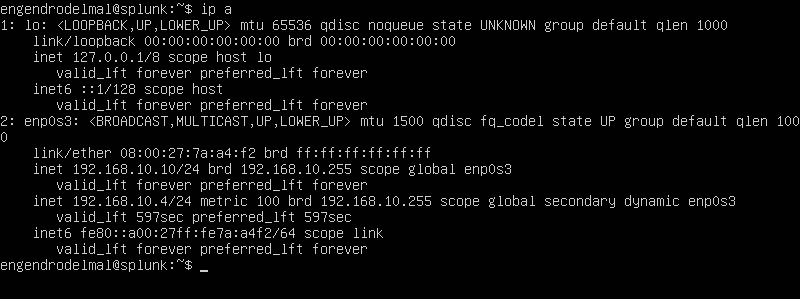

Check the connection by pinging Google, for example.

## Install Splunk in the Ubuntu server

In the **host machine** I downloaded the Linux version (.deb) of **Splunk Enterprise**. 

Back to the Splunk virtual machine it's time to install the guest add-ons for VirtualBox by running `sudo apt-get install virtualbox-guest-additions-iso`.
After a successfull installation, I added a new Shared folder for the Splunk virtual machine, by selecting `Devices => Shared Folders => Shared Folders Settings`. The **Folder Path** here must be the folder where we put the **Splunk installer**, in my case is named `ISOs`, and check the options `Read only`, `Auto mount` and `Make Permanent`.

After rebooting the virtual machine, I added a user to the **vboxsf**. First, running `sudo apt-get install virtualbox-guest-utils` and rebooting, and after that we should be able to add the user by runnign the command `sudo adduser engendrodelmal vboxsf`. 

Then, I created a new directory called **share** and then mounted the shared folder onto the new **share** directory, in my case, by running `sudo mount -t vboxsf -o uid=1000,gid=1000 ISOs share/`:

- `-t vboxsf` specifies the filesystem type, here means **VirtualBox Shared Folder**. 
- `-o uid=1000` sets the **owner** of the mounted files to the user with UID `1000`, in my case the main user.
- `gid=1000` sets the **group** ownership to the group with GID `1000`, usually the same as the main user's primary group. This makes sure that this user, not just root, can read/write the files in the shared folder.
- `share/` is the **mount point**, the directory inside the Ubuntu virtual machine where the contents of `ISOs` will apear.

Navigatin to the `share` folder and running `ls -la` the list of files should look something like this:

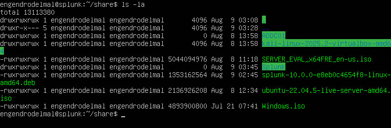

I installed Splunk running the command `sudo dpkg -i splunk-10.0.0-e8eb0c4654f8-linux-amd64.deb`. After the installation, Splunk is installed uder `/opt/splunk` so I changed to that directory and run `ls -la` to list the content:

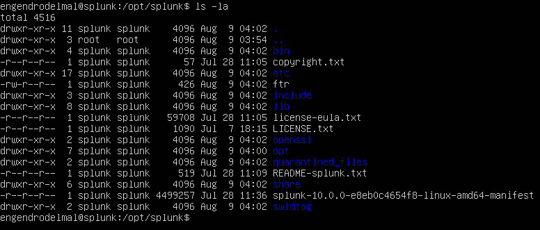

Notice that all belongs to both the user and group `splunk` (which is good, as limits the permissions to that user and group), so I switched to that user by running `sudo -u splunk bash`.

Now, changed to the directory `bin`, as the files listed in here all the binaries used by Splunk. Type `./splunk start` to run the installer and followed the steps. 

After a successfull installation, I wanted to make sure that **Splunk** starts up every time the virtual machine reboots. I `exit` and changed the directory to `bin` and run the command `sudo ./splunk enable boot-start -user splunk`.

